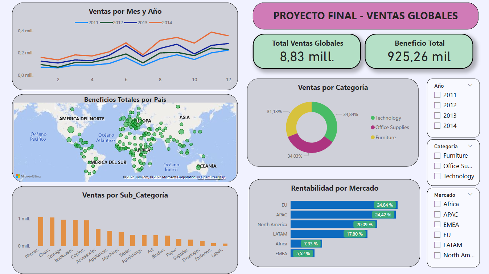
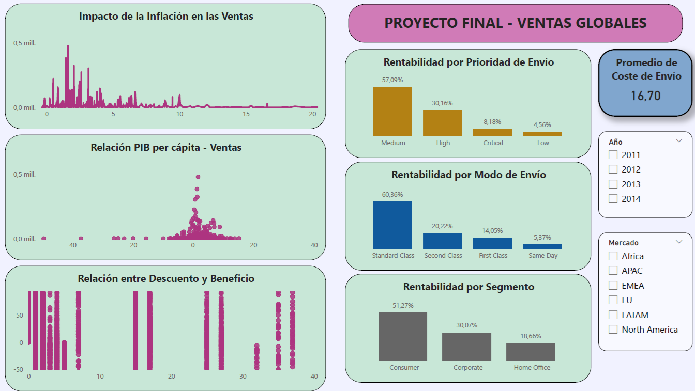

# Proyecto Final: Análisis de Ventas Globales

Este proyecto tiene como objetivo analizar las ventas en el mercado global, identificando relaciones con factores macroeconómicos y oportunidades de mejora en la rentabilidad y eficiencia operativa. 

## Descripción del Proyecto

Este estudio final tiene como finalidad evaluar el comportamiento del mercado global y los factores macroeconómicos que influyen en la rentabilidad y el desempeño de las ventas. 

El dataset incluye información detallada sobre ventas, beneficios, descuentos, costos de envío y datos macroeconómicos por país, como el PIB per cápita, inflación y el nivel de exportaciones e importaciones. Se ha desarrollado un enfoque integral que combina el Análisis Exploratorio de Datos (EDA) en Python y la creación de un dashboard interactivo en Power BI para identificar tendencias clave y patrones que afectan la rentabilidad y el desempeño de cada mercado.

Es importante indicar que el dataset del mercado global presentado solo se enfoca en 3 Categorías (Technology, Office Supplies, Furniture), cada una de las cuales incluye una serie de productos como sub-categorías, y también están divididas solo en 3 Segmentos (Consumer, Home office, Corporate).

Para garantizar un análisis enfocado y significativo, el estudio se ha centrado en el análisis de las ventas y los márgenes de beneficio, el impacto de los factores económicos, como la inflación y el crecimiento del PIB, y el desempeño de los métodos de envío.

## Directorio

    Proyecto Final/

    ├─── data/
          ├─── data_raw/
                  ├── superstore.csv
                  ├── indicators.xlsx
          ├─── data_processed/
                  ├── limpieza.csv
                  ├── transformacion.csv
                  ├── nulos_cat.csv
                  ├── conjunto_datos_final.csv  

    ├─── src/
          ├── sp_analisis_general.py
          ├── sp_cleaning.py
          ├── sp_visualizations.py
    
    ├─── notebooks/
          ├── 1. eda_preliminar.ipynb
          ├── 2. cleaning.ipynb
          ├── 3. categoricas.ipynb
          ├── 4. numericas.ipynb
          ├── 5. informe_final.ipynb

    ├─── assets/
          ├── ventas.png
          ├── indicadores.png
          ├── Proyecto Final.png

    ├─── dashboard/
          ├── Proyecto_final.pbix
    
    ├─── README.md 

## Estructura de los Datos

Los datos obtenidos provienen de la unión de 2 datasets distintos, uno que presenta la información de ventas en el mercado global (https://www.kaggle.com/datasets/fatihilhan/global-superstore-dataset) y otro que contiene algunos datos macroeconómicos por país (https://data.worldbank.org/). En ambos casos los datos reflejados son del periodo 2011-2014.

El dataset final contiene 51.243 filas y 28 columnas que brinda la siguiente información:

- **Category**: La categoría de los productos vendidos.

- **City**: La ciudad donde se realizó el pedido.

- **Country**: El país en el que está ubicado.

- **Customer_ID**: Un identificador único para cada cliente.

- **Discount**: El descuento aplicado al pedido.

- **Market**: El mercado o región donde opera.

- **Order_Date**: La fecha en la que se realizó el pedido.

- **Order_ID**: Un identificador único para cada pedido.

- **Order_Priority**: El nivel de prioridad del pedido.

- **Product_ID**: Un identificador único para cada producto.

- **Product_Name**: El nombre del producto.

- **Profit**: La ganancia generada por el pedido.

- **Quantity**: La cantidad de productos ordenados.

- **Sales**: El monto total de ventas del pedido.

- **Segment**: El segmento del cliente (Consumer, Home office, Corporate).

- **Ship_Date**: La fecha en la que se envió el pedido.

- **Ship_Mode**: El método de envío utilizado para el pedido.

- **Shipping_Cost**: El costo de envío del pedido.

- **State**: El estado o región dentro del país.

- **Sub_Category**: La subcategoría de productos dentro de la categoría principal.

- **Year**: El año en el que se realizó el pedido.

- **Weeknum**: El número de semana en el que se realizó el pedido.

- **Inflation(%)**: Porcentaje de inflación en el país correspondiente.

- **Exports_GDP(%)**: Porcentaje de exportaciones respecto al PIB del país.

- **Imports_GDP(%)**: Porcentaje de importaciones respecto al PIB del país.

- **GDP_Growth(%)**: Crecimiento del PIB en porcentaje.

- **Month**: Mes en el que se realizó el pedido.

- **Quarter**: Trimestre en el que se realizó el pedido.

## Herramientas utilizadas para el análisis

- **Python**: Análisis exploratorio de datos y visualizaciones.

- **Pandas y NumPy**: Limpieza y manipulación de datos.

- **Seaborn y Matplotlib**: Visualización de datos.

- **Power BI**: Creación del dashboard interactivo.

## Desarrollo del Proyecto

- Se realiza un primer análisis de los datos para entender su estructura.
- Se revisa el archivo superstore.csv para su posterior fusión con el otro dataset. No se realizan modificaciones.
- En el caso del archivo indicators.xlsx se realizan cambios en los nombres de algunas columnas para su mejor entendimiento y que además facilite la unión con el otro archivo.
- Se fusionan ambos archivos y hago un left join con las columnas 'Country' y 'Year' porque quiero mantener todas las filas de la tabla principal (superstore) y agregar la información de la tabla 'indicadores' cuando haya coincidencia en esas columnas.
- Con el archivo unificado empezamos con la transformación de los datos, eliminando columnas innecesarias, agregando nuevas columnas y normalizando los datos.
- Se continúa con el análisis descriptivo de las columnas categóricas y temporales. No se observan valores nulos ni duplicados. Se realiza una gráfica para visualizar su distribución.
- Se realiza el análisis descriptivo de las columnas numéricas. Se generan gráficas (boxplots) para verificar la presencia de outliers y se calculan usando el método del rango intercuartílico (IQR). Asimismo se usa este método para eliminar los outliers, pero se mantienen los de los datos macroeconómicos al ser datos representativos.
- La gestión para eliminar nulos estará en función de un umbral del 5%.
- Todos los valores se encuentran por debajo del umbral. Se imputan con el método fillna usando la mediana en todos los casos.
- Finalmente se crean visualizaciones para representar patrones y tendencias clave. El análisis se distribuye en Ventas y Rentabilidad, el impacto de las variables macroeconómicas y la eficacia de los métodos de envío.
- Recopilamos los insights que se han deducido del análisis.

## Dashboard

## Conclusiones

### Principales hallazgos
- Las categorías de productos más rentables no siempre son las más vendidas.
- Se encontró una relación negativa moderada entre los descuentos y la rentabilidad.
- La inflación tiene un impacto negativo leve en la rentabilidad.
- Los países con mayor PIB per cápita tienden a registrar mayores ventas.
- Costos de envío más altos podrían estar asociados con productos más caros, que generan más beneficios.

###  Recomendaciones 
- Optimizar estrategias de descuentos para minimizar pérdidas.
- Mejorar la eficiencia logística en regiones con alto costo de envío, sobre todo de productos tecnológicos.
- Implementar estrategias diferenciadas por país, según su situación macroeconómica.

## Contribuciones
Las contribuciones a este proyecto son bienvenidas. Si tienes alguna sugerencia, mejora o corrección, no dudes en ponerte en contacto o enviar tus ideas.

Cualquier tipo de contribución, ya sea código, documentación o feedback, será valorada.

¡Gracias por tu ayuda y colaboración!

## Autor
- Johnny [Github Profile](https://github.com/jbdatalytics)